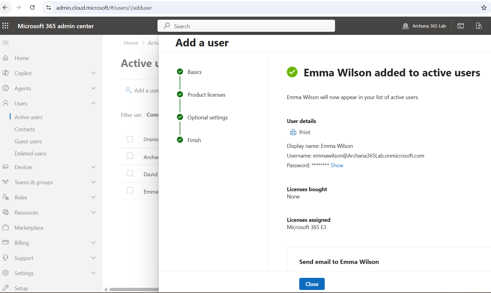
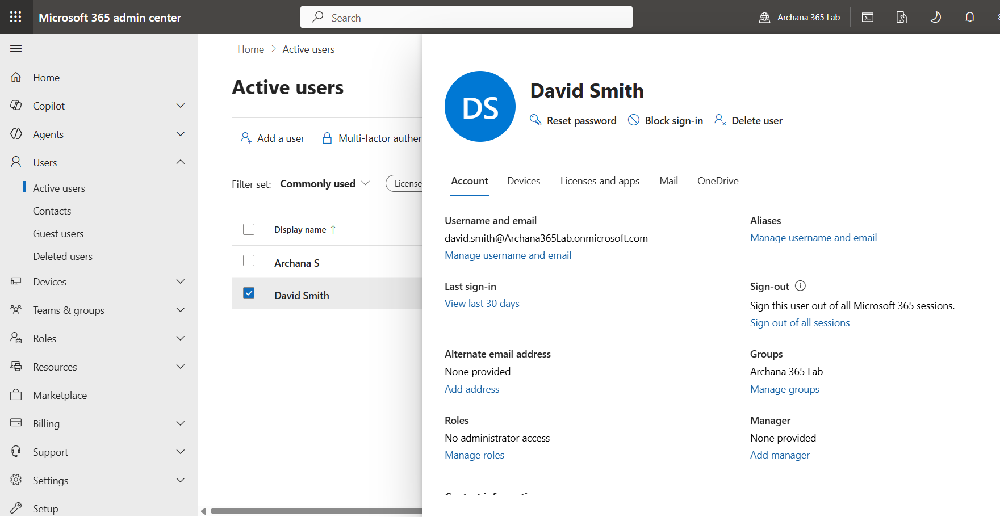

# 01 - Entra ID: User & Group Management

## What I Did
Practiced creating and managing user accounts in Microsoft 365 Admin Center using a free Developer Tenant, focusing on common helpdesk tasks like user creation, license assignment, and account properties.

## Steps Performed

### 1. Created New Users
Created sample test users in the M365 Admin Center (Users → Active Users → Add a user) to practice the user creation workflow.

### 2. Configured User Properties
For each user, reviewed and edited:
- Contact info 
- License assignment
- Account sign-in status 

### 3. Key Learnings
- New users require a license assigned before they can use mail/Teams/OneDrive
- Blocking sign-in is a common helpdesk task for offboarding without deleting the account
- Usernames map directly to the primary email address and UPN (User Principal Name)

## Screenshots

**1. User Created Confirmation**

**2. User Properties Page**
Screenshot of the user's properties page after clicking into the newly created user, showing account details.

