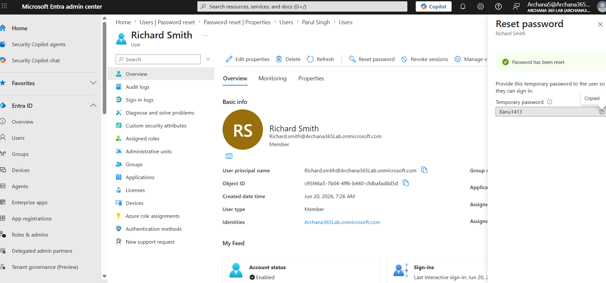
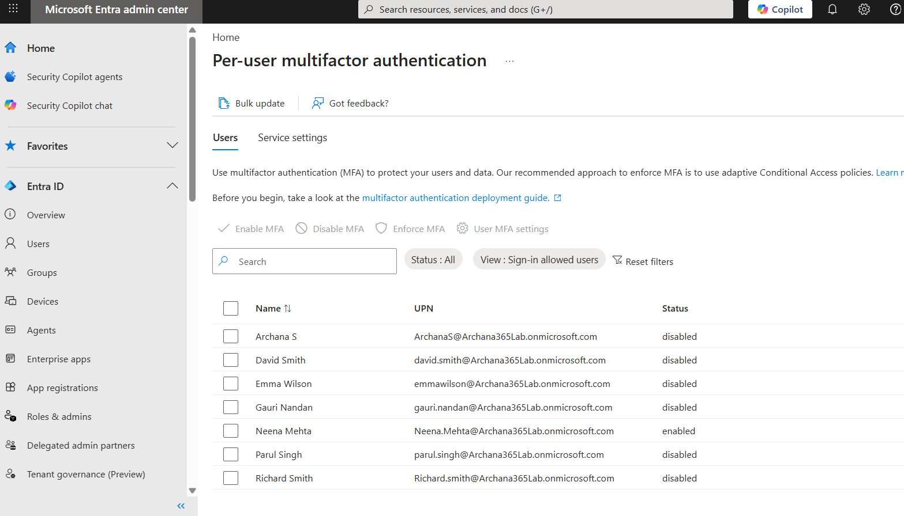
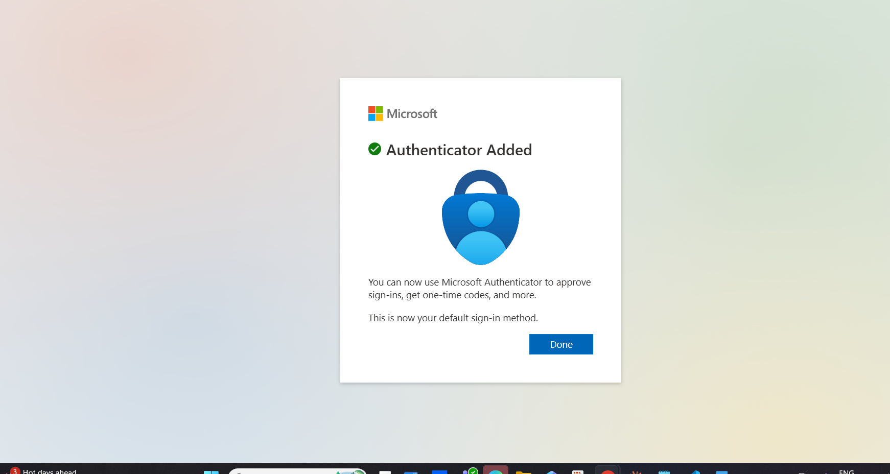
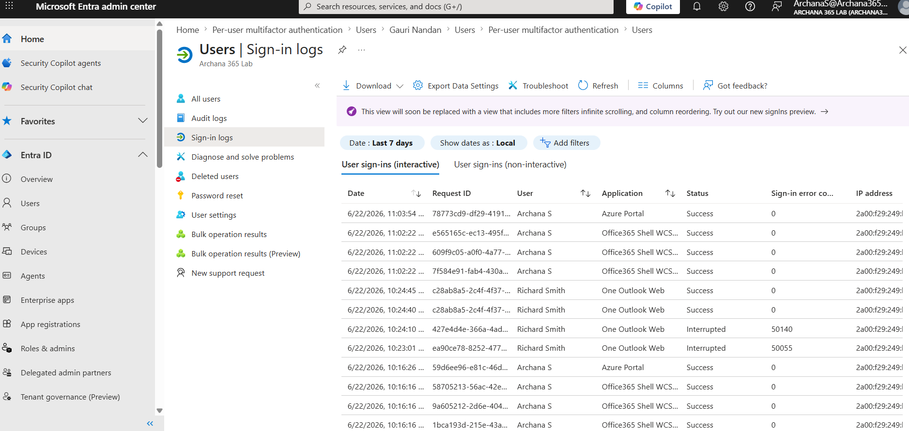
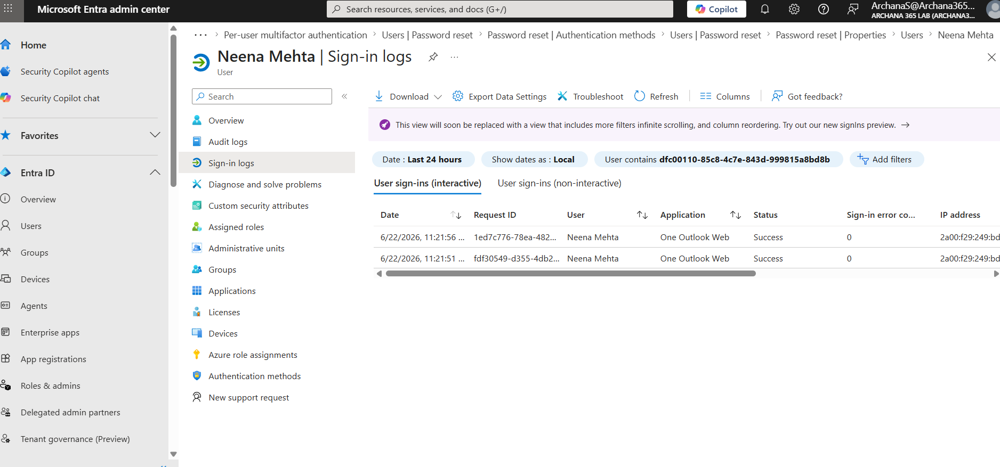
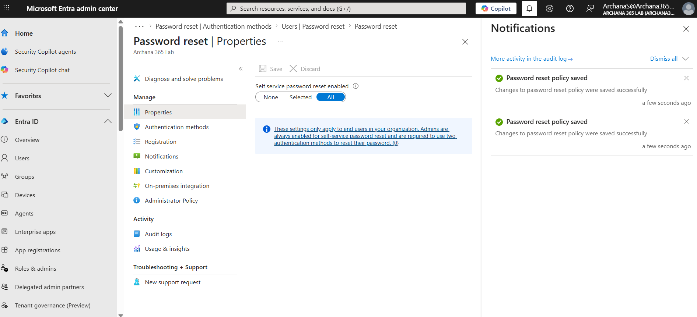

# Microsoft Entra ID: Advanced User Management & Multi-Factor Authentication

## What I Did
Practiced advanced user management and security features in Microsoft Entra ID using a free Developer Tenant. I successfully reset user passwords with enforcement policies, enabled Multi-Factor Authentication (MFA) for user accounts, configured Self-Service Password Reset (SSPR), and monitored user sign-in activity to understand security and authentication workflows.

## Steps Performed

### 1. Accessed Microsoft Entra ID Admin Center
Navigated to the Entra ID admin center at entra.microsoft.com and authenticated with trial account credentials to access advanced user management and security features.

### 2. Reset User Password with Enforcement
Used the password reset functionality to reset a user's password and enforced a password change on the user's next sign-in. This demonstrates the first step in account troubleshooting and security management.

**Password Reset Process:**
- Located user account (Neena Mehta)
- Clicked "Reset password"
- Checked "User must change password at next sign-in"
- Generated temporary password
- User received temporary password and created permanent password on next sign-in

**Password Reset Confirmation**

### 3. Enabled Multi-Factor Authentication (MFA)
Configured Per User MFA settings to require users to verify their identity through multiple authentication methods. MFA significantly improves security by requiring a second verification factor beyond just a password.

**MFA Setup Steps:**
- Navigated to Multi-factor authentication settings
- Selected user (Neena Mehta)
- Enabled Per User MFA
- User received prompt to set up authenticator app
- User scanned QR code to register Microsoft Authenticator

**MFA Enabled for User**

### 4. Tested MFA Sign-In Process
Verified that MFA enforcement works correctly by signing in and confirming the authentication workflow. This demonstrates understanding of the complete MFA sign-in process.

**MFA Sign-In Flow:**
- User entered username and password
- System prompted "Approve this sign-in in your authenticator?"
- User opened Microsoft Authenticator app
- User tapped "Approve"
- Successfully signed in with two-factor verification

**MFA Approval Prompt**

### 5. Monitored Sign-In Activity and Logs
Reviewed user sign-in logs to understand authentication success/failure patterns and verify that MFA was functioning correctly. Sign-in logs are critical for security monitoring.

**Sign-In Log Details Reviewed:**
- Date and time of sign-in
- Application accessed (Outlook, Portal, etc.)
- Sign-in status (Success or Failure)
- MFA result (Approved or Not required)
- Device and location information
- Reason for failure (if applicable)

**Sign-In Activity Logs**

### 6. Understood Sign-In Log Details
Examined individual sign-in entries to understand what information is available for troubleshooting and security monitoring.

**Sign-In Entry Details Include:**
- User identity
- Timestamp of sign-in attempt
- Application accessed
- Success or failure status
- MFA status and result
- Device information (OS, browser)
- Geographic location
- Conditional Access policies applied

**Sign-In Details**

### 7. Configured Self-Service Password Reset (SSPR)
Enabled SSPR to allow users to reset their own passwords without contacting the help desk. SSPR reduces help desk ticket volume significantly (30-40% reduction typical).

**SSPR Configuration:**
- Enabled SSPR for all users
- Configured authentication methods:
  - Email address verification
  - Mobile phone verification
- Set requirement: Users must verify with 1 method
- Policy applied organization-wide

**SSPR Configuration**

## Key Learnings

- **Password Reset Workflow:** Administrators can reset user passwords, optionally force users to change them at next sign-in, and send temporary passwords. This is a core help desk task.

- **Multi-Factor Authentication (MFA):** MFA requires users to verify identity through two or more methods. Even if a password is compromised, an attacker cannot access the account without the second factor.

- **MFA Methods:** Microsoft Authenticator app (preferred) provides push notifications; alternatives include phone calls, SMS messages, and hardware tokens. Authenticator app is most secure.

- **MFA Sign-In Process:** Username/password first, then "Approve in Authenticator?" appears, user approves in app, access granted. Seamless but secure.

- **Per User MFA vs. Authentication Methods:** Per User MFA is the simpler, older method to enforce MFA on specific users. Enables/disables with one click.

- **Sign-In Logs:** Every authentication attempt is logged with timestamp, app, status, MFA result, and location. Essential for troubleshooting and security monitoring.

- **Self-Service Password Reset (SSPR):** Allows users to reset passwords independently through email or phone verification. Reduces help desk ticket volume by 30-40%.

- **Help Desk Impact:** Password resets represent ~30% of help desk requests. SSPR and proper policies significantly reduce workload while improving user experience.

- **Security Best Practice:** Requiring MFA prevents 99.9% of account compromises. Password-only authentication is insufficient in modern environments.

- **Monitoring & Compliance:** Sign-in logs provide audit trail for compliance requirements and security investigations.

## Lab Completion Summary

Successfully completed an advanced Microsoft Entra ID user management and security lab covering password administration, Multi-Factor Authentication setup and testing, Self-Service Password Reset configuration, and sign-in log monitoring. This lab covers critical security and user management skills required for help desk and IT support roles.

**Key Takeaway:** Password and MFA management are core help desk responsibilities that directly impact both security and user experience
