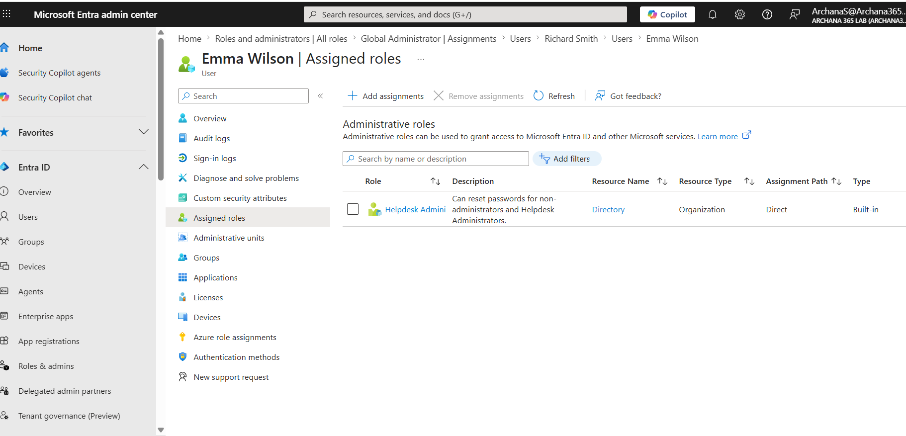
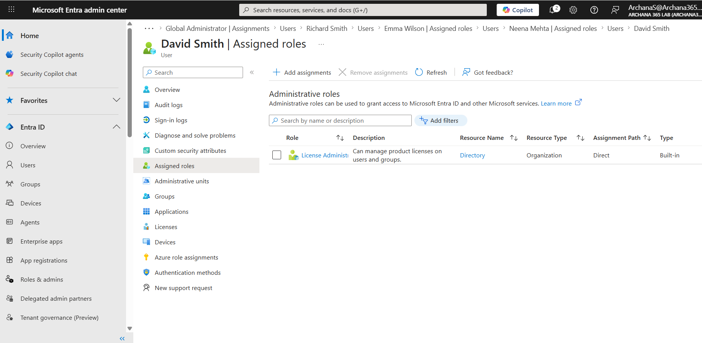
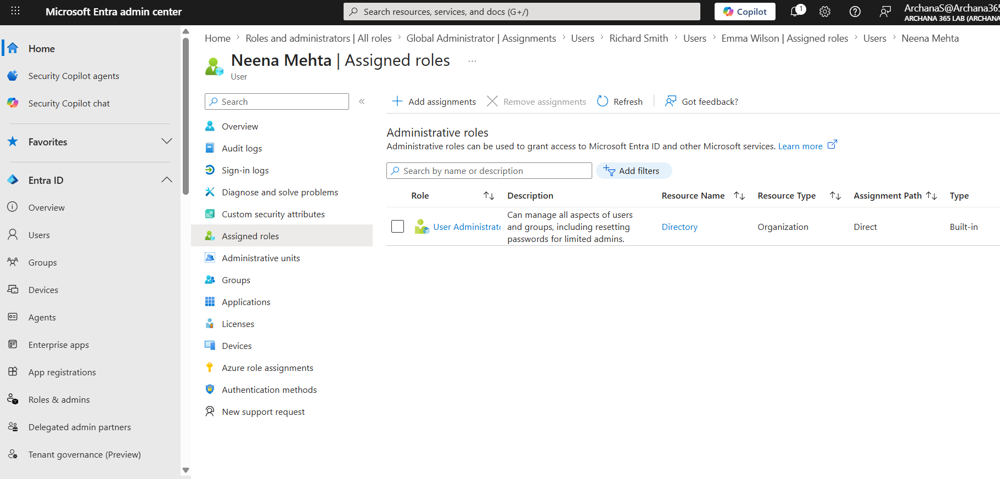
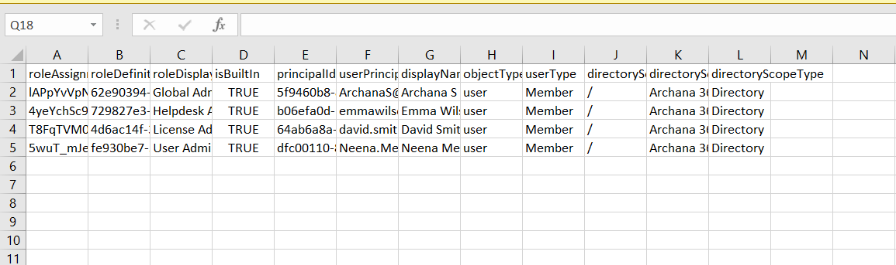

# Microsoft Entra ID: Administrative Roles & Delegated Admin

## What I Did
Practiced implementing role-based access control (RBAC) in Microsoft Entra ID using a free Developer Tenant. I successfully assigned different administrative roles to users, understanding the principle of least privilege and how to delegate admin tasks safely without granting Global Admin access to everyone.

## Steps Performed

### 1. Accessed Roles and Administrators
Navigated to the Entra ID admin center and located the Roles and administrators section to review available administrative roles and current assignments.

### 2. Understood Admin Role Hierarchy
Reviewed the different administrative roles available and their capability levels to understand role-based access control concepts.

**Available Roles:**
- Global Administrator (full control)
- User Administrator (create/delete users)
- Help Desk Administrator (password resets only)
- License Administrator (manage licenses)
- Exchange Administrator (email management)
- Teams Administrator (Teams management)
- Security Administrator (security policies)

### 3. Assigned Help Desk Administrator Role
Assigned the Help Desk Administrator role to Emma Wilson, enabling her to reset user passwords and unlock accounts without granting full admin access.

**Help Desk Administrator Capabilities:**
- Reset user passwords
- Unlock user accounts
- Force user sign-out
- View user information
- Cannot create users
- Cannot assign licenses
- Cannot manage groups

**Help Desk Admin Assignment**

### 4. Assigned License Administrator Role
Assigned the License Administrator role to David Smith, limiting his permissions to only license management tasks.

**License Administrator Capabilities:**
- Assign Microsoft 365 licenses
- Remove licenses
- View license reports
- Cannot create users
- Cannot reset passwords
- Cannot manage groups

**License Admin Assignment**

### 5. Assigned User Administrator Role
Assigned the User Administrator role to Neena Mehta, enabling her to create, edit, and delete user accounts.

**User Administrator Capabilities:**
- Create new users
- Delete users
- Reset user passwords
- Edit user properties
- Cannot assign Global Admin role
- Cannot change organization settings

**User Admin Assignment**

### 6. Downloaded Role Assignments Report
Downloaded a CSV file containing all role assignments to document the current delegation structure. The report showed four role assignments across the organization.

**Role Assignments CSV:**
- Global Administrator: Archana S (yourself)
- Help Desk Administrator: Emma Wilson
- License Administrator: David Smith
- User Administrator: Neena Mehta

**Downloaded Assignments Report**

### 7. Verified Role Assignments for Each User
Confirmed that each user profile accurately reflected their assigned administrative role by checking the "Assigned roles" section for each user.

**Verification Results:**
- Emma Wilson: Help Desk Administrator ✓
- David Smith: License Administrator ✓
- Neena Mehta: User Administrator ✓
- Archana S: Global Administrator (yourself) ✓

### 8. Documented Principle of Least Privilege
Understood and documented how delegating specific roles improves security by giving each person only the permissions they need to do their job.

**Principle of Least Privilege Benefits:**
- Security improved: each account has limited permissions
- Damage limited if account compromised
- Clear accountability for admin actions
- Easier to audit and track changes
- Reduces accidental misconfigurations
- Scales safely as organization grows

## Key Learnings

- **Role-Based Access Control (RBAC):** Different users receive different permission levels based on job responsibilities. Not everyone needs Global Admin access.

- **Global Administrator:** The most powerful role with full control of everything. Should only be assigned to 1-3 people maximum and must require MFA.

- **Help Desk Administrator:** Limited role that can only reset passwords and unlock accounts. Perfect for support teams without granting unnecessary permissions.

- **License Administrator:** Restricted to license management only. Prevents accidental changes to other systems while allowing license responsibility.

- **User Administrator:** Can create, edit, and delete users but cannot change Global Admin roles or organizational settings. Ideal for HR and onboarding teams.

- **Principle of Least Privilege:** Every user should have the minimum permissions needed to perform their job. This is a fundamental security principle.

- **Delegated Administration:** Spreading admin tasks across multiple people with appropriate roles improves security, accountability, and reduces single points of failure.

- **Damage Limitation:** If a Help Desk Admin account is compromised, attacker can only reset passwords. If Global Admin is compromised, attacker has full access. Delegation significantly reduces risk.

- **Audit Trail:** Each admin action is logged by role and user. Delegation makes it clear who did what and improves compliance.

- **Scalability:** As organizations grow, delegated admin allows tasks to be distributed without security compromises.

## Lab Completion Summary

Successfully completed an advanced Microsoft Entra ID administrative roles and delegation lab. Demonstrated understanding of role-based access control, how to assign administrative roles appropriately, and the principle of least privilege. This lab covers critical security and delegation concepts required for IT support professionals managing cloud environments.

**Time Required:** 60 minutes  
**Key Takeaway:** Delegating specific admin roles improves security significantly compared to sharing Global Admin access
