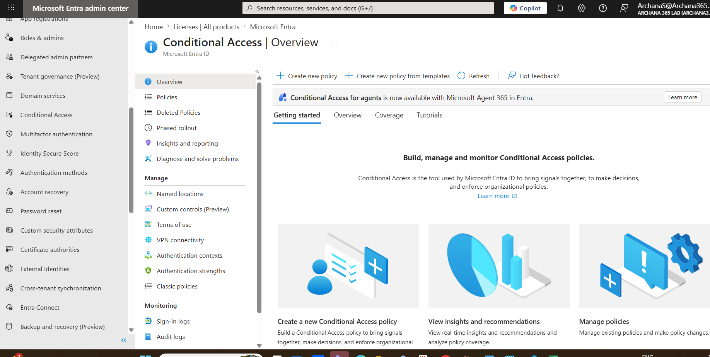
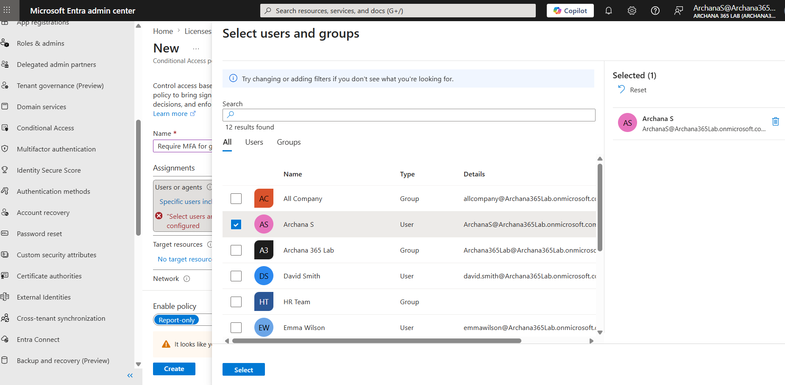
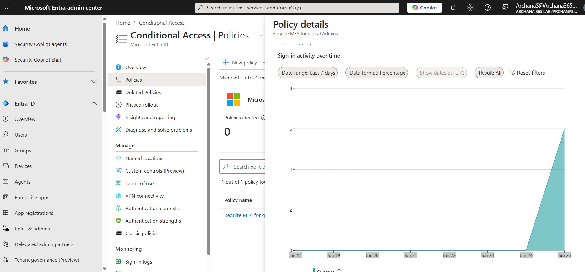
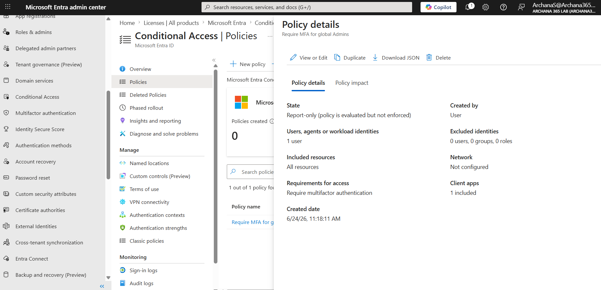

# Microsoft Entra ID: Conditional Access & Security Policies

## What I Did
Practiced implementing advanced security policies in Microsoft Entra ID using Conditional Access. I successfully created and configured conditional access policies to enforce Multi-Factor Authentication (MFA) for administrators and monitor sign-in activity. This lab demonstrates understanding of dynamic security controls and risk-based access management.

## Steps Performed

### 1. Accessed Conditional Access Section
Navigated to the Microsoft Entra ID admin center and located the Conditional Access section under Security to begin creating policies that enforce organizational security requirements.

**Conditional Access Overview**

### 2. Understood Conditional Access Concepts
Reviewed the fundamentals of Conditional Access: dynamic policies that evaluate conditions (who, what, where, risk level) and enforce controls (require MFA, block access, require compliance) automatically based on real-time signals.

**Key Concept:**
Conditional Access = IF (conditions) THEN (controls)
- Conditions: User identity, app being accessed, location, device state, sign-in risk
- Controls: Require MFA, require device compliance, block access, approve by admin

### 3. Created Policy 1: Require MFA for Global Admins
Created the first conditional access policy to enforce Multi-Factor Authentication for all users with Global Administrator role. This protects the most privileged accounts from unauthorized access.

**Policy 1 Configuration:**
- Name: "Require MFA for global Admins"
- Target Users: Global Administrators 
- Target Resources: All cloud apps (Outlook, Teams, SharePoint, etc.)
- Condition: None (always applies)
- Control: Require multifactor authentication
- Status: Report-only (safe testing mode)

**Policy Creation**

### 4. Configured Access Control
Set the access control to require Multi-Factor Authentication for the policy. This means users matching the policy conditions must verify their identity using a second authentication method (phone, app, security key).

**Access Control Details:**
- Grant Type: Require MFA
- Additional Controls: None
- Session Controls: None (could add re-authentication frequency)

**Access Control Setup**

### 5. Enabled Policy in Report-only Mode
Set the policy to "Report-only" mode initially. This safe testing approach monitors policy activity without blocking users, allowing verification that the policy works correctly before full enforcement.

**Report-only Mode Benefits:**
- Users not blocked
- Activity monitored
- Policy evaluated on every sign-in
- Safe testing approach
- Can review impact before enabling

### 6. Monitored Policy Activity and Sign-in Tracking
Reviewed the policy dashboard showing sign-in activity over the last 7 days. The chart demonstrates that the policy is actively monitoring sign-in attempts and capturing security events.

**Activity Monitoring:**
- Chart displays sign-in activity over time
- Spike visible when policy was actively monitoring
- Shows policy is functioning correctly
- Tracks every sign-in attempt
- No users blocked (report-only mode)

**Sign-in Activity Chart**

### 7. Reviewed Policy Configuration Details
Examined the complete policy settings to verify correct configuration of users, resources, conditions, and access controls. The policy dashboard shows:
- Policy name and description
- Number of users affected
- Resources protected
- Access control requirements
- Policy status and mode

**Policy Details Review**

### 8. Understood Real-World Applications
Documented how conditional access policies protect organizations by automatically enforcing security requirements based on risk signals. Real-world scenarios include:
- Blocking high-risk sign-ins automatically
- Requiring MFA for sensitive applications
- Enforcing device compliance
- Restricting access from specific locations
- Requiring approval for risky activities

## Key Learnings

- **Conditional Access Fundamentals:** Dynamic security policies that evaluate real-time conditions and enforce controls automatically. More powerful than static "allow all" or "deny all" approaches.

- **Conditions vs. Controls:** Conditions are the IF statements (user, app, location, risk). Controls are the THEN actions (require MFA, block, require compliance). Together they create flexible security policies.

- **Report-only Mode:** Safe testing approach that monitors policy activity without blocking users. Essential for preventing accidental lockouts before full enablement.

- **MFA Enforcement:** Requiring Multi-Factor Authentication significantly reduces account compromise risk. Even if password is stolen, second factor prevents unauthorized access.

- **Privileged Account Protection:** Global Admin accounts require maximum protection through MFA enforcement. These are the highest-value targets for attackers.

- **Risk-based Access:** Policies can automatically detect suspicious sign-in patterns (impossible travel, new device, leaked credentials) and require additional verification.

- **Zero Trust Principles:** Conditional Access implements zero-trust security by verifying every access request based on multiple factors rather than trusting users based on network location.

- **Policy Monitoring:** Sign-in logs and charts show policy impact. Critical for understanding which policies are triggering and how often, enabling informed security decisions.

- **Gradual Rollout:** Best practice is to start with report-only mode, monitor activity, then gradually enable for specific groups before organization-wide rollout.

- **Security vs. Usability:** Policies must balance security (preventing attacks) with usability (not blocking legitimate users). Report-only testing helps find this balance.

## Lab Completion Summary

Successfully completed an advanced Microsoft Entra ID Conditional Access lab demonstrating implementation of dynamic security policies. Created and configured a Conditional Access policy requiring MFA for Global Administrators, enabled safe report-only monitoring, and verified policy activity tracking. This lab covers critical security concepts for protecting privileged accounts and implementing zero-trust security principles.

**Key Takeaway:** Conditional Access enables dynamic, risk-aware security policies that automatically enforce security controls based on real-time signals rather than static rules
