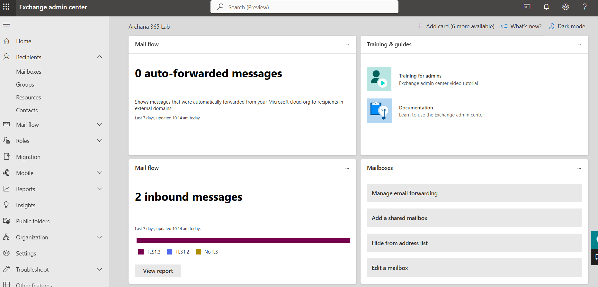
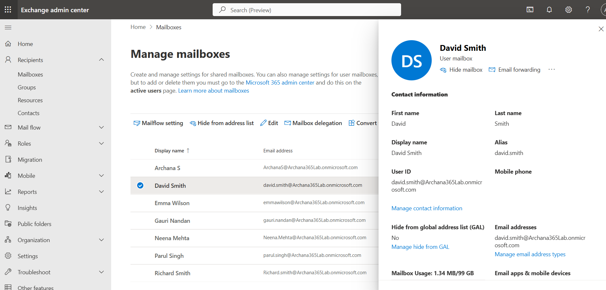
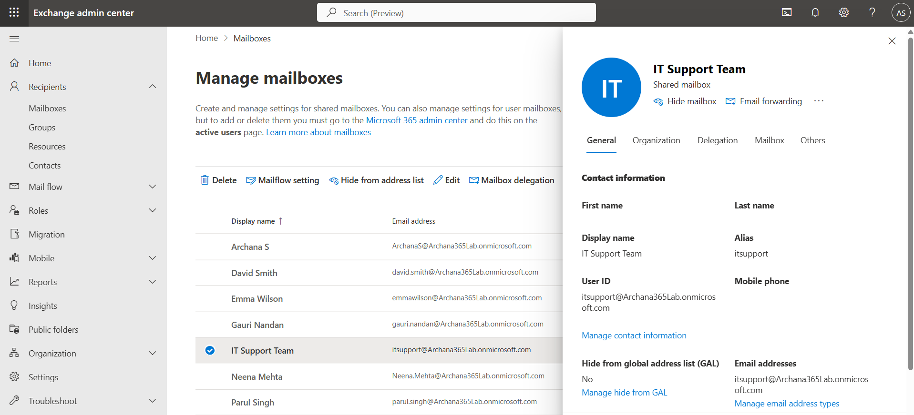
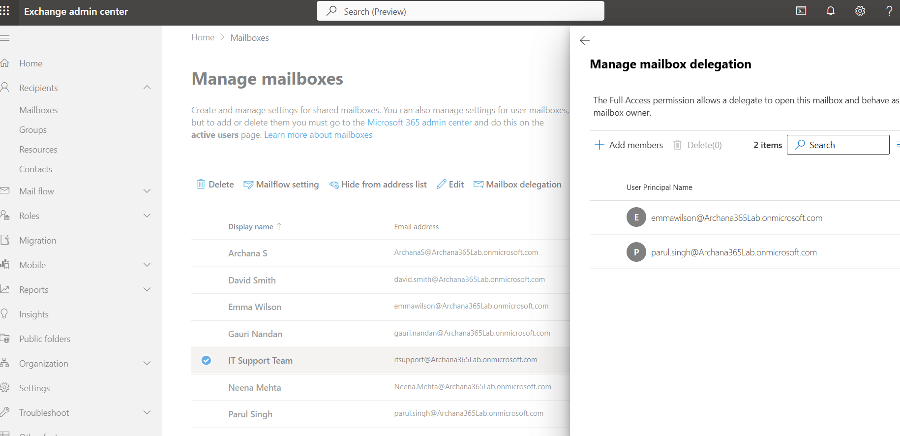
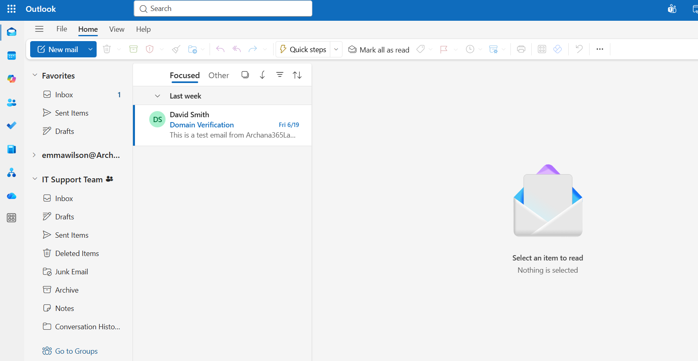
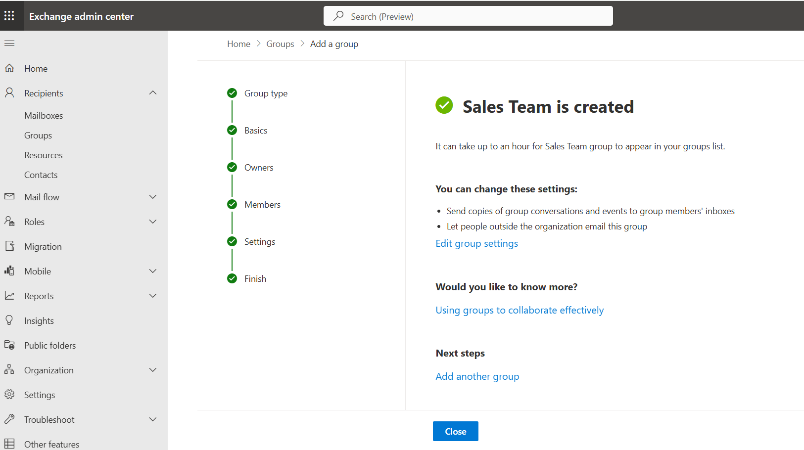
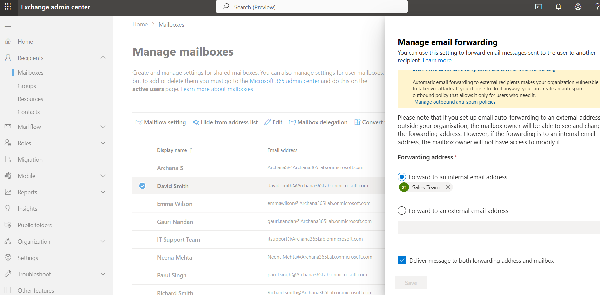

# Microsoft 365: Exchange Online Email Management

## What I Did
Practiced email management and collaboration features in Microsoft Exchange Online using a free Developer Tenant. I successfully created and configured shared mailboxes for team collaboration, created distribution groups for email communication, and implemented email forwarding for automated message routing. This lab demonstrates understanding of enterprise email infrastructure and help desk email administration.

## Steps Performed

### 1. Accessed Exchange Admin Center
Navigated to the Exchange Admin Center to manage mailboxes, groups, and email settings. This is the central hub for all email administration and configuration tasks in Microsoft 365.

**Exchange Admin Overview**

### 2. Reviewed Existing Mailboxes
Examined the different types of mailboxes in the organization to understand the mailbox hierarchy and user email structure. Reviewed user mailboxes for Archana Singh, David Smith, Emma Wilson, and other team members.

**Existing User Mailboxes:**
- User Mailbox: Individual email for each person
- Size: 50 GB per user
- Access: Only the individual user
- Example: david.smith@company.com

**Mailbox Types Overview**

### 3. Created Shared Mailbox for Team Collaboration
Created an IT Support Team shared mailbox that multiple team members can access and manage together. Shared mailboxes are essential for department-wide email addresses and team collaboration on email queues.

**Shared Mailbox Configuration:**
- Name: IT Support Team
- Email: itsupport@Archana365Lab.onmicrosoft.com
- Type: Shared mailbox (50 GB capacity)
- Access: Multiple authorized users
- Purpose: Team inbox for support requests

**Shared Mailbox Created**

### 4. Added Members to Shared Mailbox
Configured permissions for team members to access the shared mailbox. Members added include Emma Wilson and Parul Singh, who now have full read/write access to the support team inbox.

**Member Assignment:**
- Emma Wilson: Full Access
- Parul Singh: Full Access
- Permission type: Read and manage (Full Access)
- Result: Both can send and receive from itsupport@ address

**Members Added to Shared Mailbox**

**Shared Mailbox present in outlook**

### 5. Created Distribution Group
Created a Sales Team distribution group to facilitate email communication to multiple recipients through a single email address. Distribution groups are used for company announcements, team communications, and targeted messaging.

**Distribution Group Details:**
- Name: Sales Team
- Email: salesteam@Archana365Lab.onmicrosoft.com
- Type: Distribution list
- Purpose: Email group for team communications
- Members: Can be added dynamically

**Distribution Group Created**

### 6. Configured Email Forwarding
Set up email forwarding for David Smith's mailbox to automatically forward copies of his emails to the support team mailbox. This ensures team coverage when individuals are busy or away from their desk.

**Email Forwarding Setup:**
- Source: david.smith@Archana365Lab.onmicrosoft.com
- Forward to: salesteam@Archana365Lab.onmicrosoft.com
- Delivery: Emails go to both David's inbox AND support mailbox
- Use case: Team coverage, vacation backup, cross-training

**Email Forwarding Configuration**

### 7. Understood Real-World Email Scenarios
Documented common scenarios where email management features are used in actual business environments. These real-world applications demonstrate the practical value of Exchange Online administration.

**Real-World Scenarios Documented:**
- Support team shared inbox for customer requests
- Distribution group for company announcements
- Email forwarding for team coverage

## Key Learnings

- **Mailbox Types:** User mailboxes are individual (50 GB), shared mailboxes are for teams (50 GB), resource mailboxes for scheduling, and group mailboxes integrate with Teams and collaboration features.

- **Shared Mailboxes:** Enable team collaboration on a single email address. Multiple authorized users can access, read, and respond to emails. Critical for department inboxes and shared responsibilities.

- **Distribution Groups:** Email lists that send messages to all members when you send to the group address. Useful for company announcements, department updates, and targeted team communications.

- **Email Forwarding:** Automatically routes copies of emails to another recipient while maintaining original delivery. Used for team coverage, vacation backup, and cross-training scenarios.

- **Permission Management:** Shared mailbox access is controlled through delegation with full access permissions (read, write, delete) for authorized members.

- **Help Desk Relevance:** Email administration is 50% of help desk daily work. Common tickets include "add me to this shared mailbox," "remove access," "set up email forwarding," and "distribution group membership."

- **Real-World Applications:** Every organization uses these features for team collaboration, department communications, and workload distribution.

- **User Experience:** Team members see shared mailboxes in their Outlook sidebar and can send/receive from the shared email address, appearing professional to external recipients.

## Real-World Application

In a help desk or IT administration role, you would manage scenarios like:

- **Support Team Setup:** Create support@company.com shared mailbox, add 5-10 support staff, configure to handle customer inquiries as a team.

- **Department Communications:** Create distribution groups for HR, Finance, Marketing to send company-wide announcements or department updates.

- **Team Coverage:** Forward emails for employees on vacation, sick leave, or in meetings so urgent issues are addressed by the team.

- **New Employee Onboarding:** Add new hires to appropriate distribution groups and shared mailboxes so they receive team communications immediately.

- **Delegation:** Set up email forwarding and delegation for executives' assistants to manage their email while they're in meetings or traveling.

- **Cross-Training:** Forward experienced employee's emails to newer staff member for learning and gradual responsibility transfer.

- **Customer Service:** Route customer emails to shared inbox where multiple agents can track, respond, and escalate issues.

Understanding Exchange Online is essential for help desk professionals as email management is a daily responsibility.

## Lab Completion Summary

Successfully completed an advanced Microsoft 365 Exchange Online lab covering email management, shared mailboxes, distribution groups, and email forwarding. Demonstrated understanding of how organizations use Exchange Online for team collaboration, email routing, and communication infrastructure. This lab covers critical skills for help desk professionals as email administration represents a significant portion of daily support responsibilities.
flexibility for coverage and delegation
