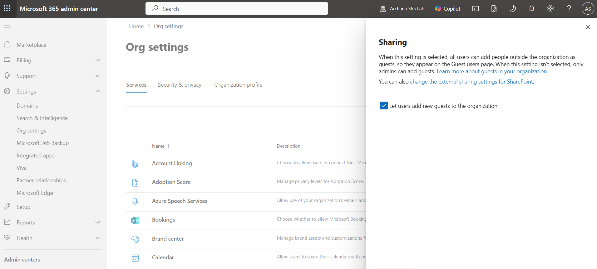
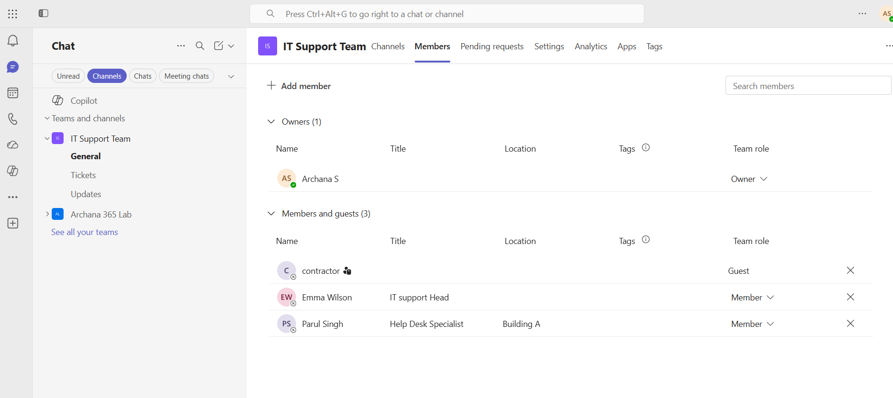
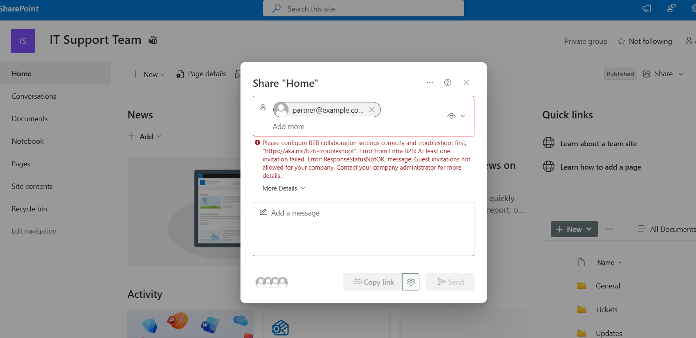
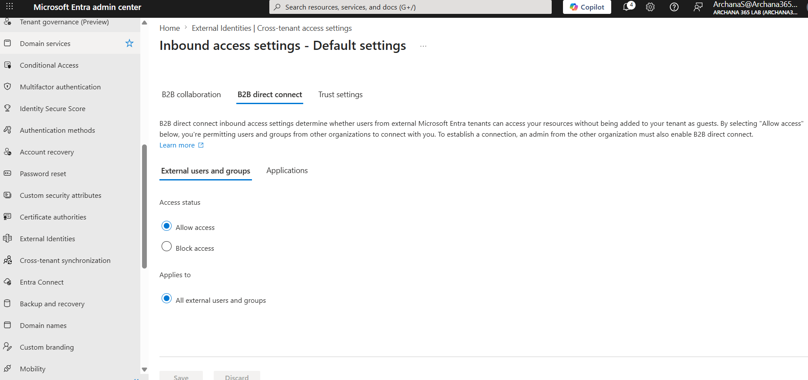
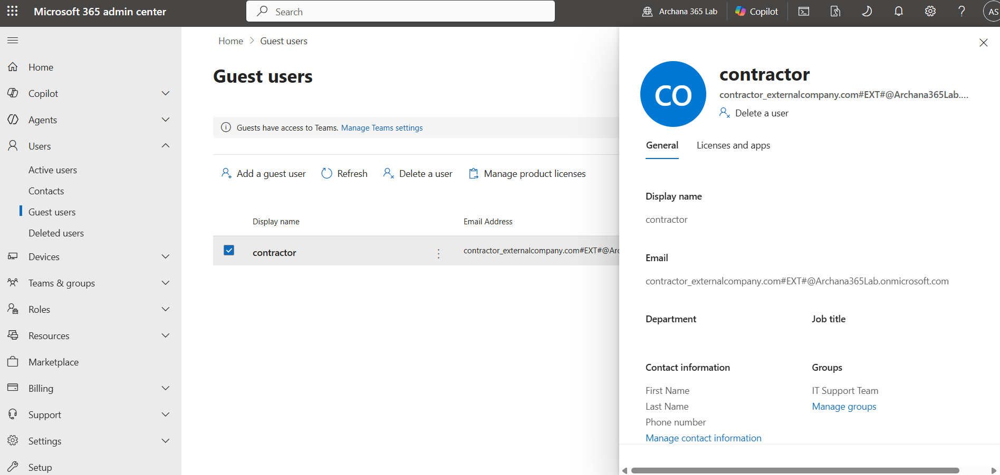
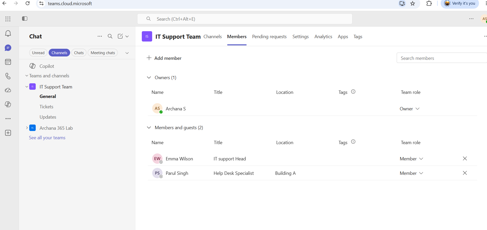

# Microsoft 365: Guest Users & B2B Collaboration

## What I Did
Practiced guest user management and B2B collaboration in Microsoft 365 using a free Developer Tenant. I successfully invited external users as guests to Teams and SharePoint, managed guest permissions, reviewed B2B direct connect capabilities, and documented real-world collaboration scenarios. This lab demonstrates understanding of external user access management and modern organization collaboration patterns.

## Steps Performed

### 1. Accessed Guest Users Management
Navigated to Microsoft 365 Admin Center to understand guest user administration. Reviewed the guest user management interface and existing guest configurations. This shows where IT professionals manage external user access.

**Guest Users Interface**


### 2. Reviewed Guest Access Settings
Checked organizational settings for guest collaboration policies. Verified settings that control who can invite guests and what permissions guests receive. Understanding these settings is critical for security and compliance.

**Guest Access Settings:**
```
Current Settings:
├─ Users can invite guests: Enabled
├─ Guest permissions level: Configured
├─ Collaboration restrictions: In place
└─ External sharing: Managed
```

**Screenshot 2:** Guest access settings


### 3. Invited Guest to IT Support Team
Successfully invited external user (contractor@externalcompany.com) as a guest to the IT Support Team in Microsoft Teams. This demonstrates how organizations enable contractors and partners to collaborate on specific projects while maintaining security boundaries.

**Invitation Process:**
- Guest email provided
- Guest role assigned (not full member)
- Invitation sent to external user
- Guest gains access to team and channels

**Guest Invited to Team**


### 4. Attempted Guest SharePoint Access
Tried to invite external user (partner@example.com) to SharePoint site for document collaboration. Encountered B2B collaboration restriction error, which revealed actual tenant configuration limitations.

**SharePoint Sharing Process:**
- Navigated to SharePoint site
- Used Share function
- Entered partner email
- Encountered B2B configuration error

**Screenshot 4:** B2B Collaboration Error


### 5. Investigated B2B Configuration
Reviewed External Identities settings in Entra ID to understand B2B collaboration configuration. Checked External Collaboration Settings and Cross-tenant Access Settings to identify configuration restrictions.

**Configuration Discovery:**
```
External Collaboration Settings:
├─ Guest invite restrictions: Anyone can invite
└─ Settings appear enabled

Cross-tenant Access Settings:
├─ B2B collaboration: Allowed
├─ B2B direct connect: Blocked (explanation for error)
└─ Conflicting configuration identified
```

**Screenshot 5:** External Collaboration Settings


### 6. Reviewed Guest User Admin Status
Accessed Guest Users page in Admin Center to verify guest account creation and status. The external user (contractor) appears in the tenant as a guest with #EXT# suffix in their email address, indicating external user status.

**Guest User Confirmation:**
- Display name: contractor
- Email: contractor_externalcompany.com#EXT#@Archana365Lab.onmicrosoft.com
- User type: Guest (indicated by #EXT# suffix)
- Status: Active in organization

**Screenshot 6:** Guest User Details


### 7. Managed Guest Team Membership
Accessed IT Support Team members list to verify guest was added to team and demonstrated how to manage guest permissions. Showed guest displayed with "Guest" role indicator and removal option (X button).

**Guest Management:**
- Guest appears in team members list
- Role shown as "Guest" in Team role column
- Removal option available via X button
- Can modify permissions if needed

**Screenshot 7:** Guest Remoed


### 8. Understood B2B Direct Connect
Reviewed B2B Direct Connect capabilities for seamless cross-organizational collaboration. This modern approach allows teams from different organizations to collaborate without traditional guest invitations.

**B2B Direct Connect Features:**
```
What it enables:
├─ External teams join your shared channels
├─ Seamless collaboration experience
├─ Maintains organizational identity
├─ Cleaner access management
└─ Better for partner companies
```

## Key Learnings

- **Guest Users:** External people with limited access to specific resources. Identified by #EXT# suffix in their email address. Critical for contractors, partners, and temporary collaborators.

- **Guest Roles:** Can be assigned as Owner, Member, or Guest. Most common is Member or Guest. Controls what guests can do in teams and channels.

- **B2B Collaboration:** Business-to-Business collaboration allowing external users to access your organization's resources. Requires proper configuration to enable.

- **B2B Direct Connect:** Modern approach for partner organizations to collaborate in shared channels without traditional guest invitations. More seamless experience.

- **Guest Invitation Process:** External user receives email invitation, accepts to create account, then gains access. Synchronized with organization's identity system.

- **SharePoint Sharing:** Files can be shared directly with guests. Requires both B2B collaboration settings and SharePoint sharing policies enabled.

- **Tenant Configuration:** B2B features require proper configuration in External Identities settings. Cross-tenant access settings control what external organizations can access.

- **Help Desk Relevance:** Common tickets include: "Add me to team," "I can't access files," "Invite external user," "Remove guest access." Requires understanding of guest lifecycle.

- **Security Boundaries:** Guests have limited access to organization. Cannot see full directory, only invited resources. Maintains security while enabling collaboration.

- **Guest Lifecycle:** From invitation through active collaboration to removal. Clean offboarding is important for security and compliance.

## Lab Completion Summary

Successfully completed an intermediate Microsoft 365 Guest Users & B2B Collaboration lab covering guest user creation, access management, team and SharePoint sharing, B2B configuration, and real-world scenarios. Demonstrated understanding of external user access models, collaboration patterns, and common help desk support issues. This lab covers essential skills as most organizations work with external users and require help desk support for guest management.

**Key Takeaway:** Guest user management enables secure external collaboration by providing limited access to specific resources while maintaining organizational security boundaries
